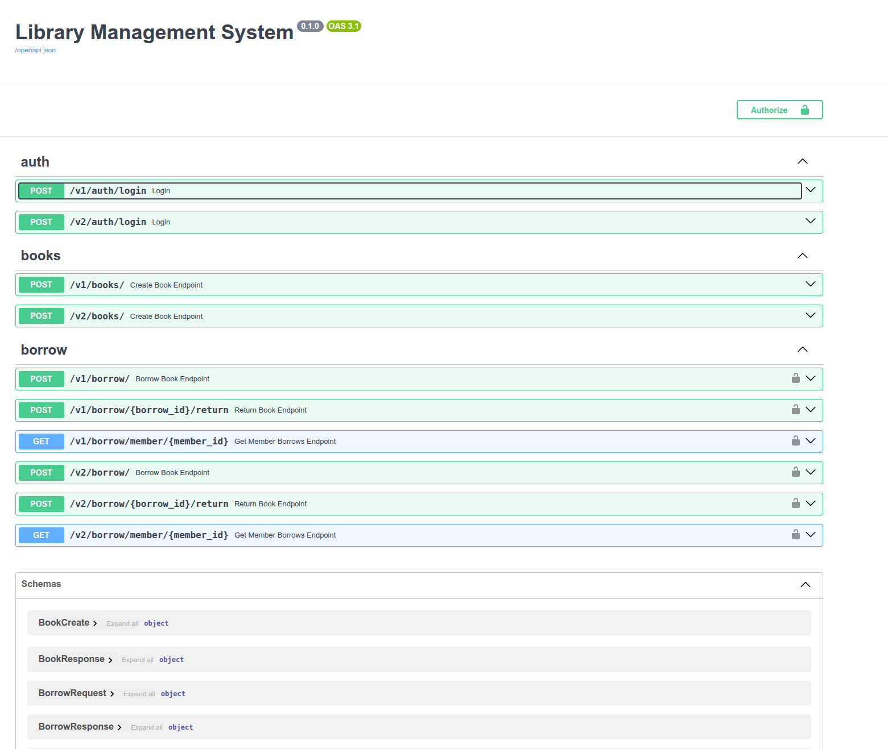

# Library servie


1. Clone or download repo.
2. Go to the folder. Make sure that you unzipped it in case if you choosed "download zip" insted of clone.

```bash
cd ./library-service
```

3. Run

```bash
docker compose up --build
```

Swagger is available at http://localhost:8000/docs




4. Test application 

```bash 
pytest -v tests/
```